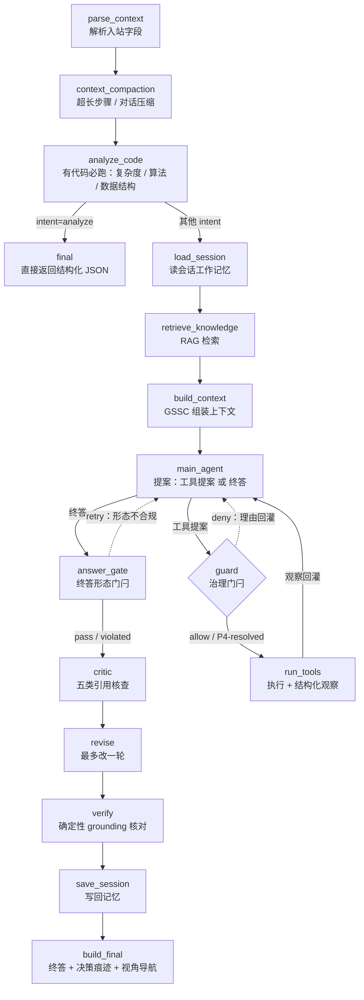

# JavaTutor Coze Agent（javatutor-coze）

部署于 Coze 平台的 Java 教学智能体：收到一条带 `run_id` 的用户提问，返回一段**落在真实执行证据上**的教学回答，以及一段透明的「决策痕迹」JSON。

本仓库是**智能体侧**项目，只负责「看懂执行过程、回答问题」；前端可视化 / 编辑器不属于本仓库范围。

## 它解决什么

学生在 JavaTutor 里跑完代码后向智能体提问——这个变量为什么变了、这一步在做什么、这段代码为什么这么写、帮我优化这段代码。智能体不凭空编造：它通过工具读取真实执行上下文与单步证据，回答引用真实行号 / 变量值，并把回答延伸成界面动作（跳到对应面板、把优化后的代码交给编辑器）。

## 核心能力

- **多工具 ReAct 真环**：图内 `main_agent → guard → run_tools` 真环，轮次预算 + 治理门闩（白名单 / 参数结构 / 文件名歧义 / 重复步骤）+ 收束轮；唯一的人机暂停点在 `guard`。
- **两个工具**：`fetch_execution_context`（按需读源码全文）、`step_facts`（读单步变量 / 堆 / 栈证据）。
- **确定性核对**：`verify` 对最终回答做 grounding 核对（步骤号 / 行号 / 堆 id 是否真实存在），只记录不判罚；`answer_gate` 对「优化第二步」做终答形态门闩（必须交付完整代码）。
- **评审 + 修订**：`critic` 做五类事实核查，`revise` 最多改一轮，回滚闸保证「改差了能回退」。
- **上下文工程**：RAG 检索 + 会话工作记忆，绝大多数信息预取注入，只有整体代码与单步证据走工具按需取。
- **输出指令通道**：回答末尾附结构化 JSON 块——`【视角导航】`（跳转面板）、`【编辑建议】`（patch / options / replace 代码修改）。
- **过程可见**：`<!--jt:process …-->` 哨兵让执行阶段与工具调用在生成期间就可见。

## 处理流程



`main_agent → guard → run_tools → main_agent` 是图内真环；`answer_gate` 是终答形态门闩（不合规打回重提案）。

## 效果验证

双轨评估：**组件级确定性指标**（本地 pytest）+ **端到端 LLM-as-Judge 四维评分**（Coze 平台，相关性 / Grounding / 上下文污染 / 教学正确性）。四轮迭代真实存档：

| 轮次 | 日期 | Judge 均分 | Grounding | 工具调用准确率 | 错误回答数 | 平均时延 | 平均 token |
|---|---|---|---|---|---|---|---|
| Round-1 | 08-17 | 3.52 | 3.10 | 0.48 | 7 | 16.6s | 1550 |
| Round-2 | 09-06 | 3.00 | 2.32 | 0.58 | 5 | 17.0s | 2961 |
| Round-3 | 09-08 | 3.04 | 2.52 | 0.81 | 8 | 19.8s | 3208 |
| **Round-4** | **09-13** | **3.75** | **3.71** | **0.87** | **0** | **14.0s** | 3027 |

Round-4 为四轮最优：Judge 均分与 Grounding 双最高、工具调用准确率 0.87、错误回答数 0、时延同步降至 14.0s。关键指标：

- 工具调用准确率 0.48 → 0.58 → 0.81 → **0.87**
- `fetch_execution_context` 调用率 Round-2 4/16 → Round-3 **15/16**
- 确定性 Grounding 核对：Round-4 核对 37 处、**0 违规**
- 稳定性：Judge 兜底率与空输出率四轮均 **0**

## 目录结构

| 路径 | 说明 |
|---|---|
| `src/graphs/javatutor/` | 图、节点、状态、意图规则（业务核心） |
| `src/graphs/javatutor/harness/` | 治理门闩 / 工具节点 / 终答形态门闩 / grounding |
| `src/graphs/javatutor/prompting/` | 主 Agent / 评审 / 修订 / 导航 / 优化引导等提示词 |
| `src/agents/` `src/tools/` `src/learning/` | 业务代码目录 |
| `src/main.py` `src/storage/` `src/utils/` `scripts/` | Coze 平台外壳，禁止修改 |
| `eval/` | 双轨评估系统（离线 + 远端） |
| `tools/` | 开发工具脚本（种子知识库 / 评审审计 / 联调探针等） |
| `config/` | LLM / 智能体配置 |
| `assets/` | 领域本体等静态资产 |
| `docs/` | spec / plan / devlog / review / 协作指南 |

## 快速开始

```bash
# 依赖（uv，默认阿里云镜像）
uv sync --frozen

# 环境变量：复制 .env.example 为 .env，填 COZE_API_URL / COZE_API_TOKEN / COZE_PROJECT_ID 等
cp .env.example .env

# 跑整条图（flow）或单个节点（node）
bash scripts/local_run.sh -m flow
bash scripts/local_run.sh -m node -n main_agent -i '{"user_question":"为什么这个变量变了"}'

# 启动 HTTP 服务
bash scripts/http_run.sh -m http -p 5000

# 测试
uv run pytest tests/ -q
```

## 文档索引

- 规约与文档总索引：[`AGENT.md`](AGENT.md)
- 本地开发规约：[`docs/local-dev-convention.md`](docs/local-dev-convention.md)
- 图结构 / 节点 / 输入输出单一事实源：[`docs/agent-collaboration-guide.md`](docs/agent-collaboration-guide.md)
- 设计 / 计划 / 实现 / 审查：`docs/spec/`、`docs/plan/`、`docs/devlog/`、`docs/reviews/`

## 部署

Coze 平台拉取远程仓库执行：入口 `src/main.py`，构建 / 运行 / 打包命令见 `.coze`（对应 `scripts/setup.sh`、`scripts/http_run.sh`、`scripts/pack.sh`）。本地仓库是唯一代码事实来源，不在平台工作区手工改代码。
