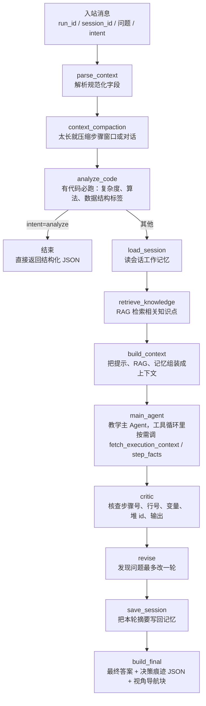

# JavaTutor Coze Agent 协作指南

一句话：这个仓库是部署在 Coze 的 Java 教学智能体，收到一条带 `run_id` 的用户提问，最后返回一段教学回答和一段决策痕迹。

## 处理流程

## 信息分层原则

这条仓库里的「工具少」不是问题，是因为**绝大部分信息不需要 agent 主动取**。信息按走法分三类：

| 信息 | 走法 | 为什么 |
| --- | --- | --- |
| 知识（RAG）、会话记忆 | **上下文工程**：预取，`build_context` 注入主模型 | 小而固定，预取便宜、确定性、可核查、省轮次 |
| 整体代码（执行上下文） | **工具（按需）**：主 Agent 按需调 `fetch_execution_context` | 量大、随请求变化；读到后先暂存 state，是否展示由 agent / 上下文工程决定，不强制注入 |
| 单步执行证据 | **工具（JIT）**：主 Agent 按需调 `step_facts` | 量大、随问题变化，按需取 |

明确**不做**的事（避免将来重复论证）：

- **不**把 `search_knowledge` / MemoryTool 暴露成 agent 工具——记忆与知识共用上下文工程路线，且该单轮问答不需要四类记忆/图谱/多模态（见 `docs/spec/2026-08-29-memory-retrieval-context-engineering-design.md`）。
- 代码读取由 `fetch_execution_context` 工具承担（agent 按需调用、先存 `state.fetched_context` 再按需展示），不再在 `build_context` 无条件注入整段代码。

## 每步在做什么

| 阶段 | 做什么 | 谁做 |
| --- | --- | --- |
| `parse_context` | 把入站 JSON 解析成图里的状态字段 | 规则 |
| `context_compaction` | 对话或步骤太长时压缩，控制 token | 规则 |
| `analyze_code` | 有代码就必跑，产出复杂度、算法、数据结构标签 | 确定性 |
| `load_session` | 读这个会话之前留下的工作记忆，按「与当前问题的相关性」挑选（候选 10 条） | 确定性 |
| `retrieve_knowledge` | RAG 检索与问题相关的知识点，产出 `retrieved_chunks` | 确定性 |
| `build_context` | 把系统提示、RAG 片段、记忆拼成一份上下文（不再无条件注入整段代码） | 规则 |
| `main_agent` | 理解问题、按需调 `fetch_execution_context` 取执行上下文 / `step_facts` 取单步证据、组织回答 | LLM |
| `critic` | 事实核查五类数字和值，防止编造 | LLM |
| `revise` | 有错就改一轮，不无限循环 | LLM |
| `save_session` | 把本轮摘要写回记忆，供下一轮复用 | 确定性 |
| `build_final` | 拼最终回答和 `【决策痕迹】` JSON，并透传可选的 `【视角导航】` 块 | 规则 |

## 输入输出

- 输入：`run_id`、`session_id`、`user_question`、可选 `intent`。
- 输出（`intent=analyze`）：结构化 JSON（复杂度、算法、数据结构标签），不经后续问答链路。
- 输出（其他 intent）：回答正文，末尾带 `【决策痕迹】` 后的一段 JSON，记录意图、来源、工具调用、token、耗时和降级标记；其中 `tool_calls` 为主 Agent 工具循环里真实产生的 LLM 工具调用（`fetch_execution_context` / `step_facts`）。回答还可附带可选的 `【视角导航】` 块（前端渲染为可点击卡片，跳转面板），协议见 `docs/spec/2026-09-07-coze-agent-view-navigation.md`。

## 上手三件事

1. 改代码前先看 `AGENT.md` 和 `docs/local-dev-convention.md`。
2. 只改业务目录，别动 Coze 平台外壳；验证跑 `uv run pytest tests/ -q` 和组件级评估。
3. Codex 负责写 spec 和 plan，Claude Code 按 plan 执行，人负责 review。

相关设计规格见 `docs/spec/`；记忆检索与上下文工程项目见 `docs/spec/2026-08-29-memory-retrieval-context-engineering-design.md`。

- **UI 面板结构同步规约**：改前端任一面板/标签（新增、删除、改名、合并、拆子页）⇒ 必须更新
  `javatutor/frontend/src/constants/ui-panel-manifest.json`（**单一事实源**），并跑 `uv run pytest tests/test_panel_sync.py`（coze）
  与前端 `npm test`；coze 侧本体 `modules`/`prompts.py` 的 UI 结构由 `scripts/sync_panel_manifest.py` 自动同步，勿手改。
  见 `docs/spec/2026-09-07-coze-agent-view-navigation.md` §9。

