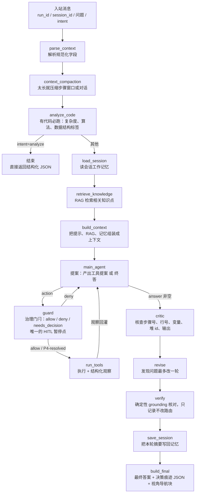

# JavaTutor Coze Agent 协作指南

一句话：这个仓库是部署在 Coze 的 Java 教学智能体，收到一条带 `run_id` 的用户提问，最后返回一段教学回答和一段决策痕迹。

## 处理流程

`main_agent` → `guard` → `run_tools` → `main_agent` 是**图内的真环**：轮次预算与治理都在环上，
不再是主 Agent 节点内部的一个 `while`。轮次预算（3 轮）与终止性证明见
`docs/spec/2026-09-11-agent-harness-react-loop-design.md` §4.3。

## agent 怎么用工具：提案 → 门闩 → 执行 → 观察

四步各在一个节点里，职责不互相越界：

| 步 | 节点 | 说明 |
| --- | --- | --- |
| 提案 | `main_agent` | 一次 LLM 调用。要么给出终答（`answer`），要么给出工具提案 `{"tool":..., "args":...}`；**它不做任何治理判断** |
| 门闩 | `guard` | 纯函数 `decide()` 裁决：白名单（P1）、参数结构（P2）、轮次预算（P3）、文件名歧义（P4）、重复步骤（P5）。allow 才放行；P4 是唯一的暂停点——HITL 开则中断等用户选文件名（`P4-resolved`，补全原提案后放行），关则降级为 deny |
| 执行 | `run_tools` | 只执行已放行的提案；查单步证据前自动前置一次 `fetch_execution_context`（不占轮次） |
| 观察 | `run_tools` / `guard` | 同一份结果两种形态：渲染文本回灌给模型（`agent_messages`），结构化 `Observation` 记进 `step_records` |

被拒的提案**不会**进 `tool_calls`（那是「实际执行的调用」记录），但拒绝原因一定回灌给模型，
否则下一轮只会重复同一个错。

## 信息分层原则

这条仓库里的「工具少」不是问题，是因为**绝大部分信息不需要 agent 主动取**。信息按走法分三类：

| 信息 | 走法 | 为什么 |
| --- | --- | --- |
| 知识（RAG）、会话记忆 | **上下文工程**：预取，`build_context` 注入主模型 | 小而固定，预取便宜、确定性、可核查、省轮次 |
| 整体代码（执行上下文） | **工具（按需）**：主 Agent 按需调 `fetch_execution_context` | 量大、随请求变化；读到后先暂存 state，是否展示由 agent / 上下文工程决定，不强制注入 |
| 单步执行证据 | **工具（JIT）**：主 Agent 按需调 `step_facts` | 量大、随问题变化，按需取 |
| 治理决策（放行 / 拒绝 / 需要用户选择） | **门闩层（纯函数裁决）**：`harness/guard.py::decide` | 必须是可测的确定性规则，不能靠提示词祈愿；裁决结果与理由走 `guard_decision` / `step_records` |

明确**不做**的事（避免将来重复论证）：

- **不**把 `search_knowledge` / MemoryTool 暴露成 agent 工具——记忆与知识共用上下文工程路线，且该单轮问答不需要四类记忆/图谱/多模态（见 `docs/spec/2026-08-29-memory-retrieval-context-engineering-design.md`）。
- 代码读取由 `fetch_execution_context` 工具承担（agent 按需调用、先存 `state.fetched_context` 再按需展示），不再在 `build_context` 无条件注入整段代码。

## 每步在做什么

| 阶段 | 做什么 | 谁做 |
| --- | --- | --- |
| `parse_context` | 把入站 JSON 解析成图里的状态字段 | 规则 |
| `context_compaction` | 对话或步骤太长时压缩，控制 token | 规则 |
| `analyze_code` | 有代码就必跑，产出复杂度、算法、数据结构标签 | 确定性 |
| `load_session` | 读这个会话之前留下的工作记忆，按「与当前问题的相关性」挑选（候选 10 条） | 确定性 |
| `retrieve_knowledge` | RAG 检索与问题相关的知识点，产出 `retrieved_chunks` | 确定性 |
| `build_context` | 把系统提示、RAG 片段、记忆拼成一份上下文（不再无条件注入整段代码） | 规则 |
| `main_agent` | 提一轮提案：要么给终答，要么给工具提案；轮次用尽后进入收束轮（只给终答） | LLM |
| `guard` | 治理门闩：白名单 / 参数结构 / 轮次预算 / 文件名歧义 / 重复步骤；唯一的 HITL 暂停点 | 纯函数 |
| `run_tools` | 执行已放行的提案，产出 Observation（渲染文本给模型 + 结构化记录给系统） | 纯函数 |
| `critic` | 事实核查五类数字和值，防止编造 | LLM |
| `revise` | 有错就改一轮，不无限循环 | LLM |
| `verify` | 对最终交付文本做确定性 grounding 核对（`verification`），**只记录、不改路由** | 纯函数 |
| `save_session` | 把本轮摘要写回记忆，供下一轮复用 | 确定性 |
| `build_final` | 拼最终回答和 `【决策痕迹】` JSON，并透传可选的 `【视角导航】` 块 | 规则 |

## 输入输出

- 输入：`run_id`、`session_id`、`user_question`、可选 `intent`；可选 `run_mode`（`"test"`/`"default"`）与 `test_case_count`
  ——本次运行的模式**事实**，由前端随每次提问送来（后端透传）；**两者同时出现或同时缺失**，缺失表示**模式未知**
  （不得当成默认模式）。语义（两种模式各要求什么）在 coze 侧知识与引导里，见 `docs/spec/2026-08-10-coze-agent-interface.md` §1.1。
- 输出（`intent=analyze`）：结构化 JSON（复杂度、算法、数据结构标签），不经后续问答链路。
- 输出（其他 intent）：回答正文，末尾带 `【决策痕迹】` 后的一段 JSON，记录意图、来源、工具调用、token、耗时和降级标记；其中 `tool_calls` 为主 Agent 工具循环里真实产生的 LLM 工具调用（`fetch_execution_context` / `step_facts`），`verification` 为 `verify` 节点的确定性 grounding 核对结果（`applicable` / `checked` / `violations` / `hallucinated` / `grounding_ok`；无执行步骤时为 `{}` 或 `applicable=false`，明确不判罚）。回答还可附带可选的 `【视角导航】` 块（前端渲染为可点击卡片，跳转面板，协议见 `docs/spec/2026-09-07-coze-agent-view-navigation.md`）与可选的 `【编辑建议】` 块（前端渲染为 diff 卡 / 优化方案卡 / 整文件覆盖卡，`kind` 取 `patch`/`options`/`replace`，协议见 `docs/spec/2026-08-10-coze-agent-interface.md` §2.2 与 `docs/spec/2026-09-10-coze-agent-code-optimization.md`）。

图内循环新增的状态字段（`state.py`，均为增量，不改动既有字段语义）：

- `agent_messages`：主 Agent 循环的**累积**消息序列（System / Human / AI / Human…）。与 `messages` 分开——后者是入站契约（`parse_context` 读其最后一条，平台 `stream_mode="messages"` 与它耦合），不能被循环过程污染。
- `proposed_action`：本轮的提案（`tool` / `args` / `raw`，或 `parse_error`），存 dict 以便进 checkpointer。
- `guard_decision`：最近一次门闩裁决（`verdict` / `policy` / `reason` / `options`）。
- `step_records`：逐动作的 Observation 记录，供决策痕迹、评测与 B 端可观测。
- `served_step_indices`：本请求内已成功查询过的 `step_index`（0-based），供门闩 P5 判重复。
- `fetched_injected`：本请求是否已把执行上下文读进 state（自动前置 fetch 或模型显式 fetch 都会置位）。
- `verification`：`verify` 节点的确定性 grounding 核对结果。

## 上手三件事

1. 改代码前先看 `AGENT.md` 和 `docs/local-dev-convention.md`。
2. 只改业务目录，别动 Coze 平台外壳；验证跑 `uv run pytest tests/ -q` 和组件级评估。
3. Codex 负责写 spec 和 plan，Claude Code 按 plan 执行，人负责 review。

相关设计规格见 `docs/spec/`；记忆检索与上下文工程项目见 `docs/spec/2026-08-29-memory-retrieval-context-engineering-design.md`。

- **UI 面板结构同步规约**：改前端任一面板/标签（新增、删除、改名、合并、拆子页）⇒ 必须更新
  `javatutor/frontend/src/constants/ui-panel-manifest.json`（**单一事实源**），并跑 `uv run pytest tests/test_panel_sync.py`（coze）
  与前端 `npm test`；coze 侧本体 `modules`/`prompts.py` 的 UI 结构由 `scripts/sync_panel_manifest.py` 自动同步，勿手改。
  见 `docs/spec/2026-09-07-coze-agent-view-navigation.md` §9。

