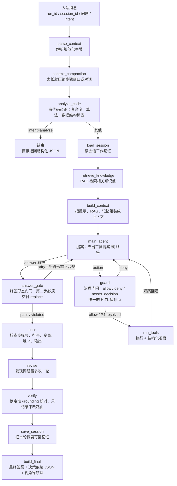

# JavaTutor Coze Agent 协作指南

一句话：这个仓库是部署在 Coze 的 Java 教学智能体，收到一条带 `run_id` 的用户提问，最后返回一段教学回答和一段决策痕迹。

## 处理流程

`main_agent` → `guard` → `run_tools` → `main_agent` 是**图内的真环**：轮次预算与治理都在环上，
不再是主 Agent 节点内部的一个 `while`。轮次预算（3 轮）与终止性证明见
`docs/spec/2026-09-11-agent-harness-react-loop-design.md` §4.3。

## agent 怎么用工具：提案 → 门闩 → 执行 → 观察

四步各在一个节点里，职责不互相越界：

| 步 | 节点 | 说明 |
| --- | --- | --- |
| 提案 | `main_agent` | 一次 LLM 调用。要么给出终答（`answer`），要么给出工具提案 `{"tool":..., "args":...}`；**它不做任何治理判断** |
| 门闩 | `guard` | 纯函数 `decide()` 裁决：白名单（P1）、参数结构（P2）、轮次预算（P3）、文件名歧义（P4）、重复步骤（P5）。allow 才放行；P4 是唯一的暂停点——HITL 开则中断等用户选文件名（`P4-resolved`，补全原提案后放行），关则降级为 deny。P4 的判据是「按 `match_file_key`（与 fetch 工具同源）**匹配不到**」，与项目有几个文件无关——单文件项目里写错文件名同样需要人来选，不会漏到工具层去吃硬错误 |
| 执行 | `run_tools` | 只执行已放行的提案；查单步证据前自动前置一次 `fetch_execution_context`（不占轮次） |
| 观察 | `run_tools` / `guard` | 同一份结果两种形态：渲染文本回灌给模型（`agent_messages`），结构化 `Observation` 记进 `step_records` |
| 终答形态门闩 | `answer_gate` | 纯函数判据：提问以 `【优化第二步】` 起头时，终答必须恰好一个 `kind:"replace"` 的【编辑建议】块、`code` 非空无 `...` 占位。不合规就**拒绝该终答**（清空 `answer`、回灌一条 `HumanMessage` 观察）并回 `main_agent` 重提案——**与 `guard` 共享同一次轮次预算**，用尽则记 `violated` 按收束策略交付。痕迹两键 `optimize_step2_gate` / `optimize_step2_retries`。判据只认**形态**（不像评审那样看语义），见 `docs/spec/2026-09-11-agent-harness-react-loop-design.md` §4.9 |

被拒的提案**不会**进 `tool_calls`（那是「实际执行的调用」记录），但拒绝原因一定回灌给模型，
否则下一轮只会重复同一个错。

## 信息分层原则

这条仓库里的「工具少」不是问题，是因为**绝大部分信息不需要 agent 主动取**。信息按走法分三类：

| 信息 | 走法 | 为什么 |
| --- | --- | --- |
| 知识（RAG）、会话记忆 | **上下文工程**：预取，`build_context` 注入主模型 | 小而固定，预取便宜、确定性、可核查、省轮次 |
| 整体代码（执行上下文） | **工具（按需）**：主 Agent 按需调 `fetch_execution_context` | 量大、随请求变化；读到后先暂存 state，是否展示由 agent / 上下文工程决定，不强制注入 |
| 单步执行证据 | **工具（JIT）**：主 Agent 按需调 `step_facts` | 量大、随问题变化，按需取 |
| 治理决策（放行 / 拒绝 / 需要用户选择） | **门闩层（纯函数裁决）**：`harness/guard.py::decide` | 必须是可测的确定性规则，不能靠提示词祈愿；裁决结果与理由走 `guard_decision` / `step_records` |
| 交付形态（第二步是否真的给了整份代码） | **门闩层（纯函数判据）**：`harness/answer_gate.py::check_step2_answer` | 同上一条同一个理由——线上实测提示词条款会被偶发违背（10 次 1 次）；判据只认形态，不合规就打回重提案，结果走 `answer_gate_decision` |

> **`fetch_execution_context` 的回包自描述（2026-09-14）**：入口解析按
> `file` → `entry_file` → `current_step_file` → 唯一文件 → `source_code` 依次兜底，
> 成功回包必带 `file`（**这次真正取到的文件**，空串 = 单文件/激活文件）与
> `file_source`（`explicit` / `entry_file` / `current_step_file` / `only_file` / `source_code`）
> 与 `code_chars`（字符数），三者同时进 `[fetch_execution_context 结果]` 与
> `tool_calls[].result`。**解析不到源码一律结构化失败**
> （`fetch_context_failed=true` + 列出候选文件名的 `error`），不再有
> `fetch_context_failed=false` 配 `code=""` 的「成功但空」——这正是「痕迹里是绿调用、
> 模型却多轮说没有源码」的成因。详见
> `docs/spec/2026-08-23-execution-context-fetch-design.md` §5.6。
>
> 前端【执行过程】区据此把 fetch 调用渲染成**卡片**：标题行 `获取执行上下文`，
> 结果行 `Main.java（主入口），1234 字`（失败为 `失败：<错误>` 且标红）。
> **只看模型传的 `args` 是不够的**：自动前置的那次 fetch（`args` 为空）与模型不传 `file`
> 的调用都没有文件名，此前只能显示一行 `调用 fetch_execution_context`。
> 2026-09-14 起 `tool_calls` 的每条调用都是一张卡片（见 devlog
> `2026-09-14-fix-fetch-context-and-duplicate-answer.md` §6–§7）。

明确**不做**的事（避免将来重复论证）：

- **不**把 `search_knowledge` / MemoryTool 暴露成 agent 工具——记忆与知识共用上下文工程路线，且该单轮问答不需要四类记忆/图谱/多模态（见 `docs/spec/2026-08-29-memory-retrieval-context-engineering-design.md`）。
- 代码读取由 `fetch_execution_context` 工具承担（agent 按需调用、先存 `state.fetched_context` 再按需展示），不再在 `build_context` 无条件注入整段代码。

## 每步在做什么

| 阶段 | 做什么 | 谁做 |
| --- | --- | --- |
| `parse_context` | 把入站 JSON 解析成图里的状态字段 | 规则 |
| `context_compaction` | 对话或步骤太长时压缩，控制 token | 规则 |
| `analyze_code` | 有代码就必跑，产出复杂度、算法、数据结构标签 | 确定性 |
| `load_session` | 读这个会话之前留下的工作记忆，按「与当前问题的相关性」挑选（候选 10 条） | 确定性 |
| `retrieve_knowledge` | RAG 检索与问题相关的知识点，产出 `retrieved_chunks`；同时发一条 stage 哨兵 | 确定性 |
| `build_context` | 把系统提示、RAG 片段、记忆拼成一份上下文（不再无条件注入整段代码）；同时发一条 stage 哨兵 | 规则 |
| `main_agent` | 提一轮提案：要么给终答，要么给工具提案；轮次用尽后进入收束轮（只给终答） | LLM |
| `answer_gate` | 终答形态门闩：第二步提问（`【优化第二步】`）的终答必须是合规的 `kind:"replace"` 整份代码，否则打回重提案（与 `guard` 共享轮次预算） | 纯函数 |
| `guard` | 治理门闩：白名单 / 参数结构 / 轮次预算 / 文件名歧义 / 重复步骤；唯一的 HITL 暂停点 | 纯函数 |
| `run_tools` | 执行已放行的提案，产出 Observation（渲染文本给模型 + 结构化记录给系统）；每个 Observation 发一条 tool 哨兵，末尾再发一条收尾 stage | 纯函数 |
| `critic` | 事实核查五类数字和值，防止编造 | LLM |
| `revise` | 有错就改一轮，不无限循环 | LLM |
| `verify` | 对最终交付文本做确定性 grounding 核对（`verification`），**只记录、不改路由** | 纯函数 |
| `save_session` | 把本轮摘要写回记忆，供下一轮复用 | 确定性 |
| `build_final` | 拼最终回答和 `【决策痕迹】` JSON，并透传可选的 `【视角导航】` 块；同时**清除本轮全部哨兵** | 规则 |

## 过程哨兵：让执行过程在生成期间就可见

**先说清事实（2026-09-13 review 更正，初版叙述有误）**：`stream_mode="messages"` 转出的是
节点返回值里**所有键**的消息对象（**不只** `messages` 键）——`agent_messages` 走 `add_messages`
reducer，所以 propose / guard / run_tools 的消息**本来就在流上**。平台 SDK 只过滤
`langgraph_node == "tools"`，其余任何非 chunk 的 `AIMessage` 一律转成 `answer`
（`SystemMessage` / `HumanMessage` 无分支，被丢弃）。**代价是这些节点的原生产出
（提案 JSON、观察文本）会以原始形态混进用户可见的 `answer` 累加流**——
这正是用户报告的「回答顶端裸工具 JSON」的根因（见
`docs/reviews/2026-09-13-process-streaming-and-strip-leading-tool-json-review.md` §1）。

哨兵要解决的不是「打开一条不存在的通道」，而是**给过程事实一个可渲染的表示**，
并让前端在渲染前把非同类的原生产出剥掉。

**格式**：`\n<!--jt:process {json}-->\n`。用 HTML 注释是关键取舍——即使前端**未**拦截
（老前端 + 新 Agent），markdown 渲染器也不会把它渲染出来
（实测 `renderMarkdown` 的自定义 renderer `html()` 返回空串，即**丢弃**）。
**最坏情况是「没有进度条」，而不是「界面上一堆乱码」。**
负载里的 `-->` 会在构造侧转义（否则解析的正则提前截断）；
**两端 `\n` 是承重的**——marked 的 HTML 块规则会吞掉注释后同一行的剩余正文。

**两个 `kind`**（开放集合，将来加 `reasoning` / `retrieval` 不必改协议）：

| kind | 语义 | 形状 |
| --- | --- | --- |
| `stage` | **覆盖式**：界面只显示最新一条 | `{"kind":"stage","text":"正在分析问题…"}` |
| `tool` | **追加式**：界面累积成列表 | `{"kind":"tool","tool":"…","args":{…},"status":"ok","latency_ms":120.5}` |

**三个发射点**：`retrieve_knowledge`（成功 `已检索知识库：命中 N 条` / 降级 `知识库检索不可用，已用通用知识回答`）、
`build_context`（`正在分析问题…`）、`run_tools`（逐 Observation 一条 tool + 收尾 `证据已就绪，正在生成回答…`）。

**红线：事件只从 `observations` 派生，绝不从 `proposed_action` 取。** 提案是「打算做」，
观察是「已经做了」，门闩改写参数或自动前置 fetch 时两者会分叉。被拒的提案根本到不了
`run_tools`，故哨兵里只可能出现白名单工具名——这条不变式由
`tests/test_harness_loop.py::test_client_stream_never_names_a_denied_tool_in_a_sentinel`
经 **SDK 转客户端消息的完整路径**守着（哨兵绕开了 `build_final` 的 `_redact_denied_tools`，
它只清洗 answer 主体）。

**状态卫生（两道防线）**：

1. **权威**：发射节点把哨兵 id 记进 `process_event_ids`，`build_final` 用 `RemoveMessage` 精确清除。
   哨兵必须经 `messages` 流出，但 `messages` 是入站契约 + checkpointer 持久化字段，
   留在终态会跨请求累积、污染上下文与 token 预算。
2. **兜底**：`build_context_node` 取历史时按 `additional_kwargs["jt_process"]` 跳过哨兵——
   即使防线 1 失效，哨兵也进不了下一轮的上下文。

id 形如 `jt-proc-{request_started_at}-{seq}`：同请求内靠 `seq` 唯一，跨请求靠时间戳唯一。
`seq` 由调用方**显式**给出（`with_process_events` 按 `len(process_event_ids) + i` 算），
不能让每条事件各自用 `len(process_event_ids)`——那样一批事件会算出同一个 id，
`add_messages` 只留最后一条，前面的静默丢失。

**⚠ 节点名约束**：哨兵能出流，**取决于 `run_tools` 不叫 `tools`**。SDK 里有一条
`if meta["langgraph_node"] == "tools": return []`（针对 LangGraph 标准 ReAct 的 `tools` 节点名）。
本仓注册为 `run_tools`，**恰好不匹配**。若改名成 `tools`，`run_tools` 的哨兵会被 SDK
**静默吞掉**（表现为进度区停住，且无任何报错）。见 `harness/tools_node.py` 的注释。

**前端侧配套**：哨兵在**渲染前**由 `src/utils/processEvents.js` 剥掉；
**开头被纯累加粘上的裸工具 JSON**（提案 delta）由
`src/utils/editSuggestion.js::stripLeadingToolJson` 剥掉（**循环**剥，判别收在 `tool` 键上，
故【视角导航】/【编辑建议】块不受影响）。两者接入 `AiTutorPanel` 的流式渲染、
`splitDecisionTrace` 与 `parseAssistantMessage`，所以流中与终态都不漏。

实现见 `src/graphs/javatutor/process_events.py`（构造 / 解析 / 消息包装，不 import 任何图内模块），
设计见 `docs/spec/2026-09-13-process-streaming-design.md`。

## 输入输出

- 输入：`run_id`、`session_id`、`user_question`、可选 `intent`；可选 `run_mode`（`"test"`/`"default"`）与 `test_case_count`
  ——本次运行的模式**事实**，由前端随每次提问送来（后端透传）；**两者同时出现或同时缺失**，缺失表示**模式未知**
  （不得当成默认模式）。语义（两种模式各要求什么）在 coze 侧知识与引导里，见 `docs/spec/2026-08-10-coze-agent-interface.md` §1.1。
- **`intent` 会改变上下文与评审口径（2026-09-14 增）**：`concept`（概念题）不再注入 `### 当前执行位置`
  （步骤/行号/变量）——此前**任何**问题都注入该 packet（relevance 0.9，全上下文最高），叠加 few-shot 里
  0 条概念类样本，导致「迪杰斯特拉算法的原理是什么？」被答成「当前这一步在做什么」；
  另外 `build_context_node` 的 `system_instructions` 由写死的 `other` 契约改为按意图取契约，
  主 Agent 系统提示按意图追加引导段（概念题：直接讲概念本身）。分流表见接口规格 §1 的「`intent` 的下游影响」。
  注意：提问 → intent 的归并仍在演进（启发式关键词见 `intent_rules.py::conservative_intent`），
  用途限于引导与评审口径，不得当成绝对真理。
- 输出（`intent=analyze`）：结构化 JSON（复杂度、算法、数据结构标签），不经后续问答链路。
- 输出（其他 intent）：回答正文，末尾带 `【决策痕迹】` 后的一段 JSON，记录意图、来源、工具调用、token、耗时和降级标记；其中 `tool_calls` 为主 Agent 工具循环里真实产生的 LLM 工具调用（`fetch_execution_context` / `step_facts`），**2026-09-14 起 `fetch_execution_context` 的记录也带 `result`**（**两条路径都是合法 JSON**，消费方统一 `json.loads`；成功为 `{"stored": true, "file", "file_source", "code_chars", ...}` 摘要且**不含 `code`**，失败为 `{"stored": false, "error": ...}`；`step_facts` 一直有），使「调了 fetch 却拿不到源码」能自证，`verification` 为 `verify` 节点的确定性 grounding 核对结果（`applicable` / `checked` / `violations` / `hallucinated` / `grounding_ok`；无执行步骤时为 `{}` 或 `applicable=false`，明确不判罚）。回答还可附带可选的 `【视角导航】` 块（前端渲染为可点击卡片，跳转面板，协议见 `docs/spec/2026-09-07-coze-agent-view-navigation.md`）与可选的 `【编辑建议】` 块（前端渲染为 diff 卡 / 优化方案卡 / 整文件覆盖卡，`kind` 取 `patch`/`options`/`replace`，协议见 `docs/spec/2026-08-10-coze-agent-interface.md` §2.2 与 `docs/spec/2026-09-10-coze-agent-code-optimization.md`）。

  决策痕迹的**过程化**三个键（2026-09-13 新增，纯增量，老消费方忽略即可）：

  - `retrieval`：RAG 检索全过程。含 `query` / `top_k` / `threshold` / `best_score` / `kept` 与 `candidates`。
    **`candidates` 含被阈值滤掉的候选**（每条带 `kept: false`），因此「检索没召回到」与「召回到但被阈值滤掉」
    在痕迹里可区分——这是此前无法定案的那个盲区（部署侧 `sources` 恒空而 `rag_degraded=false`）。
    候选带的是 `preview`（`content` 截 300 字）+ `truncated` 标志，不携带完整正文。缺 `retrieval_debug` 时恒为 `{candidates: [], best_score: 0.0, kept: 0}`。
  - `reasoning`：工具调用之间的 AI 思考片段，按轮次给出（`round` / `content` / `tool_calls`），
    取自累积的 `agent_messages` 中按序的 `AIMessage`。任一条超 1200 字即截断并置顶层 `reasoning_truncated: true`（显式，不静默裁剪）。
    **`tool_calls` 只含真的执行过的工具名**（由 `step_records` 的 `status == "ok"` 派生）——被拒的提案
    （P1 未知工具 / P2 参数非法）既不进 `tool_calls`，其工具名也不得出现在痕迹或回答里
    （与 `tool_calls` 同口径，见 spec §4.7）。提案轮的原始 JSON 同样不复制进 `content`。
  - `sources` 增强：在既有 `source` / `score` 之外**新增** `chunk_index` 与 `content_preview`；
    **`source` / `score` 的键与语义不变**（`eval/runner/retrieval_metrics.py` 依赖，只增不改）。

  `rag_degraded` 语义不变：**仅在后端失败时为 `true`**；「检索成功但 0 条越阈值」不置位（那是「无匹配」而非「故障」，混同会让诊断信号失真）。

  决策痕迹的**交付形态两键**（2026-09-14 新增，纯增量）：

  - `optimize_step2_gate`：`passed`（终答是合规的 `kind:"replace"` 整份代码）/ `violated`（轮次用尽仍未交付）/
    `not_applicable`（本条提问不是第二步）。`violated` 是**唯一**表示「用户拿到的不是整份代码」的取值。
  - `optimize_step2_retries`：门闩把终答打回重提案的次数，一次过为 `0`。与 `tool_rounds` 共享预算，恒 `<= 3`。

  决策痕迹的**评审三键**（2026-09-14 新增，纯增量）：

  - `critic_issues`：评审留下的**有效**意见（`claim` / `answer_span` / `fact` / `blocking`，文本各截 300 字）。
    「有效」= 出处可核实（`answer_span` 是回答子串、`fact` 是事实块子串）——给不出出处的意见会被流水线
    机械丢弃，痕迹里也看不到，故此键与「评审实际据以行动的那份意见」**同源**。
  - `revise_outcome`：`"accepted"`（修订稿被采纳）/ `"reverted"`（过不了验收闸，回退原答）/
    `"skipped"`（未触发 / 调用异常 / advisory 模式）。缺省 `"skipped"`。
  - `revise_revert_reason`：回退原因，未回退时 `""`。取值 `"similarity"`（题旨漂移）/
    `"nav_block"` / `"edit_block"`（修订稿丢了结构化块）/ `"grounding"`（修订稿凭空多出假引用）/
    `"recheck"`（二次评审仍判失败）。
  - **`revised` 语义收窄**（同日）：从「修订节点跑过」改为「修订稿**被采纳**」。回退时它为 `false`，
    因为用户拿到的就是原答。要看「是否触发过修订」请用 `revise_outcome`。
    另有 `revise_recheck_passed`（仅在二次评审**真的跑过**时出现，`false` 不等于答案有问题）。

  终态回答里**不含**过程哨兵：哨兵只在生成期间作为 delta 流出（见「过程哨兵」小节），
  由 `build_final` 清除。前端需在**渲染前**拦下并剥离，剥离后的正文与不带哨兵时逐字相等。

图内循环新增的状态字段（`state.py`，均为增量，不改动既有字段语义）：

- `agent_messages`：主 Agent 循环的**累积**消息序列（System / Human / AI / Human…）。与 `messages` 分开——后者是入站契约（`parse_context` 读其最后一条，平台 `stream_mode="messages"` 与它耦合），不能被循环过程污染。
- `proposed_action`：本轮的提案（`tool` / `args` / `raw`，或 `parse_error`），存 dict 以便进 checkpointer。
- `guard_decision`：最近一次门闩裁决（`verdict` / `policy` / `reason` / `options`）。
- `answer_gate_decision`：最近一次终答形态门闩裁决（`verdict` / `reason` / `retries`）。
  `verdict` 取 `passed` / `violated` / `not_applicable`，以及**瞬态**的 `retry`（回提案节点重出终答，
  终态不会停在它上面）。痕迹里的 `optimize_step2_gate` / `optimize_step2_retries` 由本字段派生。
- `step_records`：逐动作的 Observation 记录，供决策痕迹、评测与 B 端可观测。
- `served_step_indices`：本请求内已成功查询过的 `step_index`（0-based），供门闩 P5 判重复。
- `fetched_injected`：本请求是否已把执行上下文读进 state（自动前置 fetch 或模型显式 fetch 都会置位）。
- `verification`：`verify` 节点的确定性 grounding 核对结果。
- `retrieval_debug`：RAG 全量候选与阈值判定（含被滤掉的候选），供 `retrieval` 痕迹与诊断使用。与 `retrieved_chunks`（越阈值结果）分开；检索失败时仍存在（`candidates == []`），以区别「失败」与「成功但无匹配」。
- `process_event_ids`：本请求发射的过程哨兵消息 id，供 `build_final` 用 `RemoveMessage` 清理。
  **无 reducer（返回即替换）**，故每个发射节点须按 `state.get("process_event_ids", []) + [新 id]` 自行累加。
  终态被清空。详见「过程哨兵」小节。

## 上手三件事

1. 改代码前先看 `AGENT.md` 和 `docs/local-dev-convention.md`。
2. 只改业务目录，别动 Coze 平台外壳；验证跑 `uv run pytest tests/ -q` 和组件级评估。
3. Codex 负责写 spec 和 plan，Claude Code 按 plan 执行，人负责 review。

相关设计规格见 `docs/spec/`；记忆检索与上下文工程项目见 `docs/spec/2026-08-29-memory-retrieval-context-engineering-design.md`。

- **UI 面板结构同步规约**：改前端任一面板/标签（新增、删除、改名、合并、拆子页）⇒ 必须更新
  `javatutor/frontend/src/constants/ui-panel-manifest.json`（**单一事实源**），并跑 `uv run pytest tests/test_panel_sync.py`（coze）
  与前端 `npm test`；coze 侧本体 `modules`/`prompts.py` 的 UI 结构由 `scripts/sync_panel_manifest.py` 自动同步，勿手改。
  见 `docs/spec/2026-09-07-coze-agent-view-navigation.md` §9。

