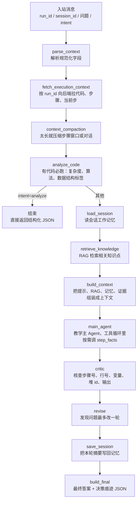

# JavaTutor Coze Agent 协作指南

一句话：这个仓库是部署在 Coze 的 Java 教学智能体，收到一条带 `run_id` 的用户提问，最后返回一段教学回答和一段决策痕迹。

## 处理流程

## 每步在做什么

| 阶段 | 做什么 | 谁做 |
| --- | --- | --- |
| `parse_context` | 把入站 JSON 解析成图里的状态字段 | 规则 |
| `fetch_execution_context` | 按 `run_id` 向后端要源代码、步骤、当前执行位置 | 确定性请求 |
| `context_compaction` | 对话或步骤太长时压缩，控制 token | 规则 |
| `analyze_code` | 有代码就必跑，产出复杂度、算法、数据结构标签 | 确定性 |
| `load_session` | 读这个会话之前留下的工作记忆 | 确定性 |
| `retrieve_knowledge` | RAG 检索与问题相关的知识点，产出 `retrieved_chunks` | 确定性 |
| `build_context` | 把系统提示、RAG 片段、记忆、执行证据拼成一份上下文 | 规则 |
| `main_agent` | 理解问题、按需调 `step_facts` 取单步证据、组织回答 | LLM |
| `critic` | 事实核查五类数字和值，防止编造 | LLM |
| `revise` | 有错就改一轮，不无限循环 | LLM |
| `save_session` | 把本轮摘要写回记忆，供下一轮复用 | 确定性 |
| `build_final` | 拼最终回答和 `【决策痕迹】` JSON | 规则 |

## 输入输出

- 输入：`run_id`、`session_id`、`user_question`、可选 `intent`。
- 输出（`intent=analyze`）：结构化 JSON（复杂度、算法、数据结构标签），不经后续问答链路。
- 输出（其他 intent）：回答正文，末尾带 `【决策痕迹】` 后的一段 JSON，记录意图、来源、工具调用、token、耗时和降级标记。

## 上手三件事

1. 改代码前先看 `AGENT.md` 和 `docs/local-dev-convention.md`。
2. 只改业务目录，别动 Coze 平台外壳；验证跑 `uv run pytest tests/ -q` 和组件级评估。
3. Codex 负责写 spec 和 plan，Claude Code 按 plan 执行，人负责 review。

